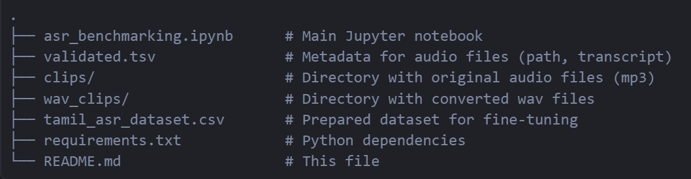

# ASRModels

## ASR Benchmarking and Fine-Tuning: English, Tamil, and Translation

This project benchmarks and fine-tunes various Automatic Speech Recognition (ASR) models—including OpenAI Whisper, Wav2Vec2, Vosk, and Google Speech-to-Text—on English and Tamil audio data. It also demonstrates translation of Tamil transcriptions to English and Hindi, and includes code for fine-tuning Whisper on a custom Tamil dataset. Next step is to incorporate minority language Sourashtra ( which I speak) into this model. Since there are very few audio excerpts ( not on large scale like English/Hindi/Tamil), collecting data will take some time. 

Key Features:

- Compare ASR models (Whisper, Wav2Vec2, Vosk, Google STT) on the same audio samples.
- Evaluate model accuracy using Word Error Rate (WER).
- Transcribe and translate Tamil audio to English and Hindi.
- Fine-tune Whisper on a parallel Tamil-English-Hindi dataset.
- Prepare and process audio datasets for ASR training.

  ## Table of Contents

- [Project Structure](#project-structure)
- [Setup & Requirements](#setup--requirements)
- [How to Use](#how-to-use)
- [Data Preparation](#data-preparation)
- [ASR Model Benchmarking](#asr-model-benchmarking)
- [Translation](#translation)
- [Fine-Tuning Whisper](#fine-tuning-whisper)
- [Results & Metrics](#results--metrics)
- [References](#references)
- [Acknowledgements](#acknowledgements)

## Project Structure


## Setup & Requirements
**Recommended: Google Colab or Jupyter Notebook**

### Python Packages

Install all dependencies with:
```bash
pip install -r requirements.txt
```

**Key packages:**
- `transformers`
- `datasets`
- `jiwer`
- `deep_translator`
- `pydub`
- `torchaudio`
- `librosa`
- `soundfile`
- `googletrans` (optional)
- `vosk`
- `google-cloud-speech` (for Google STT)
- `nltk`
- `pandas`
- `numpy`

---

## How to Use

1. **Open the notebook** (`asr_benchmarking.ipynb`) in Colab or Jupyter.
2. **Upload your audio files** (WAV format recommended).
3. **Run each cell** to:
   - Transcribe audio with different ASR models.
   - Compare WER and output.
   - Translate Tamil transcriptions to English/Hindi.
   - Fine-tune Whisper on your dataset.

---

## Data Preparation

- Place your original audio files in the `clips/` directory.
- Ensure `validated.tsv` contains columns: `path` (audio filename), `sentence` (transcript in Tamil).
- The notebook will convert mp3 to wav, and create a parallel dataset with English and Hindi translations.

---

## ASR Model Benchmarking

The notebook benchmarks:
- **OpenAI Whisper** (via HuggingFace Transformers)
- **Wav2Vec2** (HuggingFace)
- **Vosk** (offline, Kaldi-based)
- **Google Speech-to-Text** (cloud API)

Each model’s output is compared using **Word Error Rate (WER)**.

---

## Translation

- Tamil transcriptions are translated to English and Hindi using:
  - HuggingFace translation pipelines
  - `deep_translator` (Google Translate API)
- BLEU and WER metrics are used to evaluate translation quality.

---

## Fine-Tuning Whisper

- The notebook demonstrates how to fine-tune Whisper on your custom Tamil dataset.
- Prepares data, splits into train/test, and runs training with HuggingFace’s `Seq2SeqTrainer`.
- Saves the fine-tuned model and processor for future inference.

---

## Results & Metrics

- **WER** is reported for each model and translation.
- Training and validation loss, as well as WER, are tracked during fine-tuning.
- Example outputs and metrics are displayed in the notebook.

---

## References

- [OpenAI Whisper](https://github.com/openai/whisper)
- [HuggingFace Transformers](https://huggingface.co/docs/transformers/index)
- [Mozilla Common Voice](https://commonvoice.mozilla.org/)
- [Vosk Speech Recognition](https://alphacephei.com/vosk/)
- [Google Cloud Speech-to-Text](https://cloud.google.com/speech-to-text)
- [Deep Translator](https://github.com/nidhaloff/deep-translator)
- [jiwer (WER metric)](https://github.com/jitsi/jiwer)

---

## Acknowledgements

- Audio data: Mozilla Common Voice
- Model hosting: HuggingFace
- Translation: Google Translate, Facebook NLLB

---

